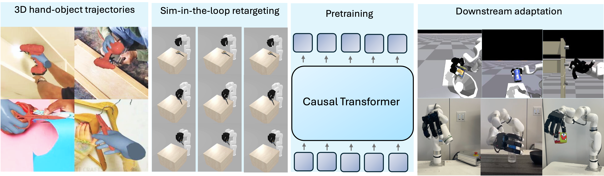

# Hand-object Interaction Pretraining from Videos

This repo contains code for the paper [Hand-object interaction Pretraining from Videos](https://hgaurav2k.github.io/manuscript.pdf)

<!-- Published in the International Conference of Computer Vision and Pattern Recognition (CVPR) 2019. -->

For a brief overview, check out the project [webpage](https://hgaurav2k.github.io/hop)!

For any questions, please contact [Himanshu Gaurav Singh](https://hgaurav2k.github.io/).

## Setup

* Create conda environment using `conda env create -f env.yml`
* Install [IsaacGym](https://developer.nvidia.com/isaac-gym) in this environment. 
* Download the [asset](https://drive.google.com/drive/folders/1BE3lg8k1kssGxojtL0OkQLscSAkbpNzS?usp=sharing) folder and put them in the root directory.  

## Running the code

### Pretraining

* Download the hand-object interaction dataset from [here](https://drive.google.com/file/d/12-xghxt0rf_0xDo5SMdrRBnNr7LWJ02Y/view?usp=drive_link). Extract using `tar -xf hoi_pretraining_data.tar.xz`. Put it under the root directory. 
* Run `bash scripts/pretrain.sh <DATADIR>`

### Finetuning 

* Download pretrained checkpoint from [here](https://drive.google.com/file/d/10zYrzPK8T-1zB8dqB5o2MfK_iF0Uda_f/view?usp=sharing). You can also use your own trained checkpoint. 
* For your choice of `task`, run `bash scripts/finetune/finetune_{task}.sh`.
<!-- 
 -->

### Visualising trained policies 

* Run `bash scripts/run_policy.sh <PATH_TO_POLICY>`.

## Citation 

## Acknowledgment
This work was supported by the DARPA Machine Common Sense program, the DARPA Transfer from Imprecise and Abstract Models to Autonomous Technologies (TIAMAT) program, and by the ONR MURI award N00014-21-1-2801. This work was also funded by ONR MURI N00014-22-1-2773. We thank Adhithya Iyer for assistance with teleoperation systems, Phillip Wu for setting-up the real robot, and Raven Huang, Jathushan Rajasegaran and Yutong Bai for helpful discussions.
